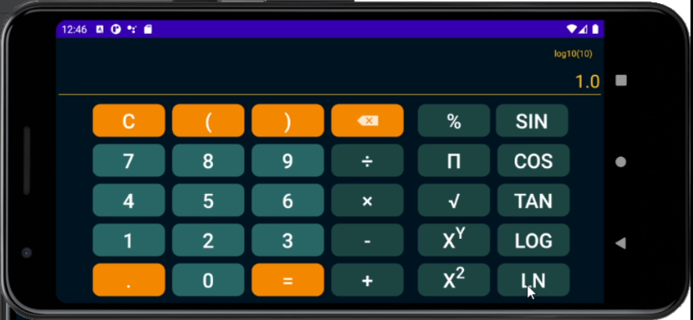
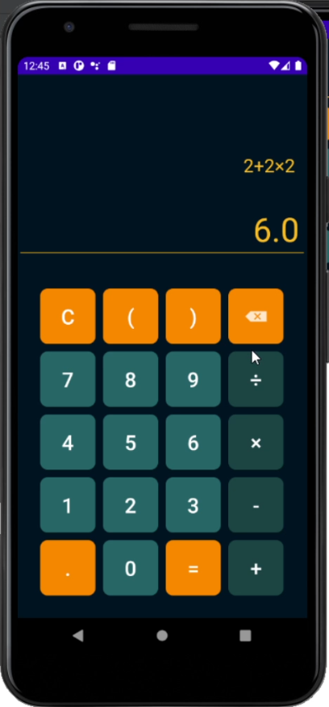
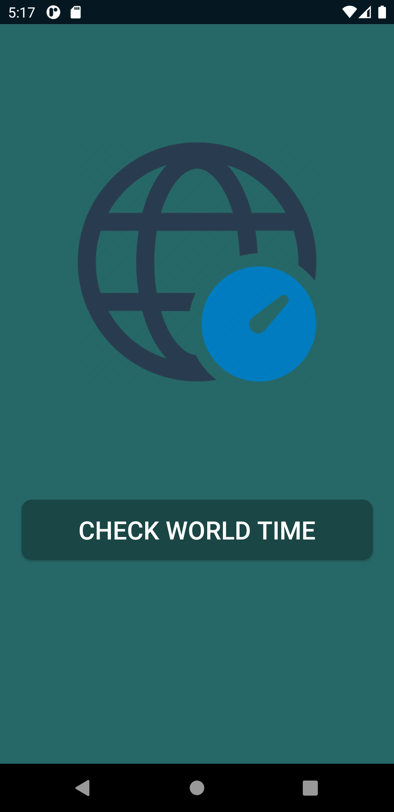
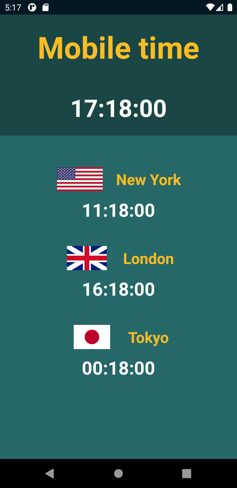
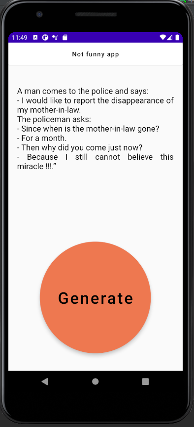
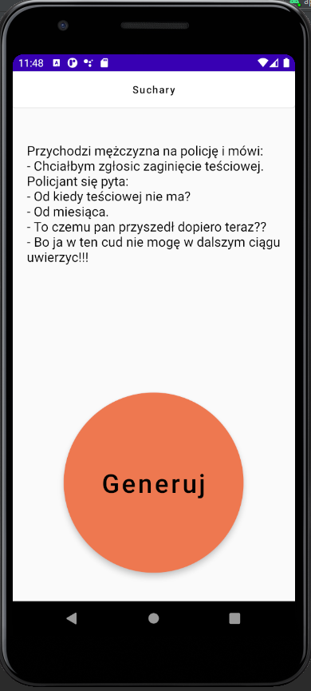
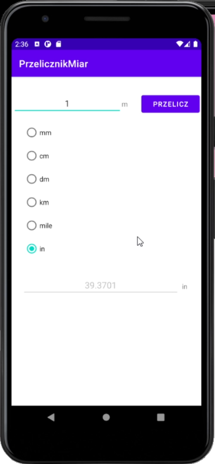

# Several simple Android applications written in Java.
This repository contains several simple applications I wrote when first encountering Java and Android Studio.

## Calculator

The application is a simple scientific calculator for Android. It allows performing basic mathematical operations such as addition, subtraction, multiplication, and division, as well as more advanced functions like calculating sine, cosine, tangent, logarithms, square roots, and others. Users can input mathematical expressions using either the button interface or the keyboard. Calculation results are presented in real-time. The application utilizes the mxparser library for analyzing and computing mathematical expressions.

## World Time
The "WorldTime" application allows users to track the current time in various time zones around the world. Upon launching the application, the user can switch to a clock view, which displays the current time as well as the time in three selected time zones: New York, London, and Tokyo. The time in each zone is updated every second.

## Joke Generator
This program is an example of a simple Android application that displays a random joke from a predefined list each time the user presses the generating button.

## Unit Converter
This program is an Android application called "Unit Converter", used for converting units of length. The application is built in Android Studio and focuses on basic functionality for converting between various units of length such as millimeters (mm), centimeters (cm), decimeters (dm), kilometers (km), miles (mi), and inches (in).

